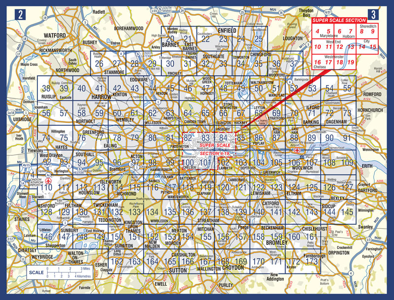
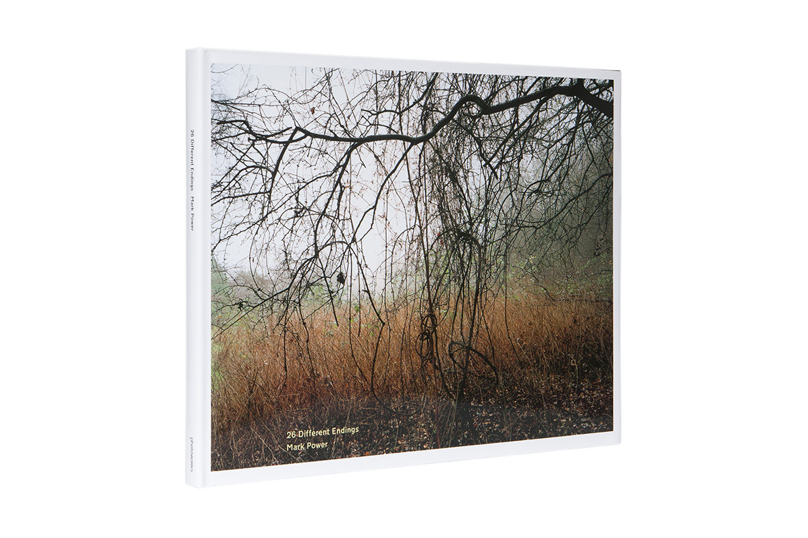

Twenty, Six, Different Endings

[Lee Johnson](http://leejo.github.io)

LPW 2016

---
## We Are Hiring!


[http://leejo.github.io/code](http://leejo.github.io/code)

---
# NQL

<p class="fragment"> (Not Quite London) </p>

---


---


---

## Twenty, Six, Different Endings

---

### Geo::IP2Location::Lite

A fork of Geo::IP2Location

---

### OOTBOO

`class Geo::IP2Location::Lite`

`has %!file is required;`

---

### Define Your Own Types

`my $IPv4_re = qr/^\d{1,3}\.\d{1,3}\.\d{1,3}\.\d{1,3}$/;`

Becomes

`subset IPv4 of Str where / (\d ** 1..3) ** 4 % '.' /;`

And:

`method get_country ( IPv4 $ip ) { ... }`

---

```nohighlight
/Volumes/code_partition/geo-ip2location-lite-p6 > perl6 -Ilib -MGeo::IP2Location::Lite

To exit type 'exit' or '^D'

> my $l = Geo::IP2Location::Lite.new( file => "samples/IP-COUNTRY-SAMPLE.BIN" );
Geo::IP2Location::Lite::Geo::IP2Location::Lite.new

> say $l.get_country_short( "foo" );
Constraint type check failed for parameter '$ip'
  in method <anon> at /Volumes/code_partition ...
  in block <unit> at <unknown file> line 1

> say $l.get_country_short( "85.5.10.0" );
CH
```
---

### Builtins

```nohighlight
sub ip2no {
    my ( $obj,$ip ) = @_;
    my @block = split(/\./, $ip);
    my $no = 0;
    $no = $block[3];
    $no = $no + $block[2] * 256;
    $no = $no + $block[1] * 256 * 256;
    $no = $no + $block[0] * 256 * 256 * 256;
    return $no;
}
```

```nohighlight
Socket::unpack("N",inet_aton($ipaddr));
```

Becomes


```nohighlight
my $ipnum = :256[$ipaddr.comb(/\d+/)];
```

---

### NativeCall

```nohighlight
sub read8 {
    my ($obj, $handle, $position) = @_;
    my $data = "";
    seek($handle, $position-1, 0);
    read($handle, $data, 1);
    return unpack("C", $data);
}
```

A replacement for unpack (still experimental with perl6)

```nohighlight
use NativeCall;

method !read8 ( IO::Handle $handle, Int $position ) {
    $handle.seek($position-1, SeekFromBeginning);
    my $data = $handle.read(1);
    nativecast((int8), Blob.new($data));
}
```

---

### Succinct

Note - neither golfed.

Geo::IP2Location::Lite perl5 = 340 LOC

Geo::IP2Location::Lite perl6 = 198 LOC

---

### Tests

```nohighlight
/Volumes/code_partition/geo-ip2location-lite-p6 > prove --exec perl6 -Ilib -r
./t/004_exceptions.t ... ok
./t/005_lookup.t ....... ok
./t/010_lookup_full.t .. ok
All tests successful.
Files=3, Tests=35,  1 wallclock secs ( 0.02 usr  0.01 sys +  0.94 cusr  0.12 csys =  1.09 CPU)
Result: PASS
```

---

### Example

```
> perl6 \
	-Ilib \
	-MGeo::IP2Location::Lite \
	-e'my $l = Geo::IP2Location::Lite.new(
		file => "IP-COUNTRY-REGION-CITY.BIN.201607"
	);
	say $l.get_country_long( "85.3.40.48" );'

Switzerland
```

---

### Available Now!

`panda install Geo::IP2Location::Lite`

`https://github.com/leejo/geo-ip2location-lite-p6`

---

### So Why "Twenty, Six, Different Endings"?

---


---



---


---


---


---


---

# NQL

[http://www.markpower.co.uk/Projects/26-DIFFERENT-ENDINGS](http://www.markpower.co.uk/Projects/26-DIFFERENT-ENDINGS)
